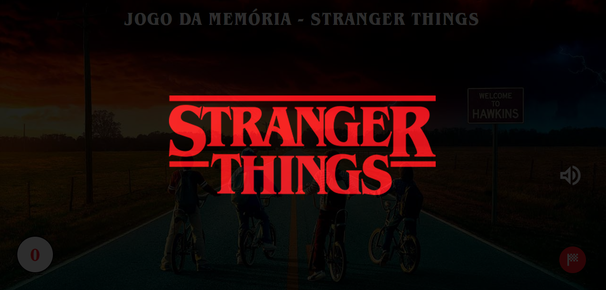
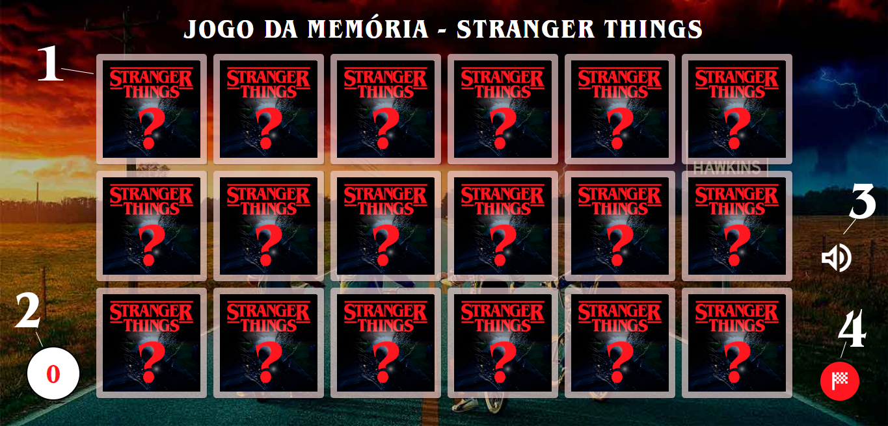
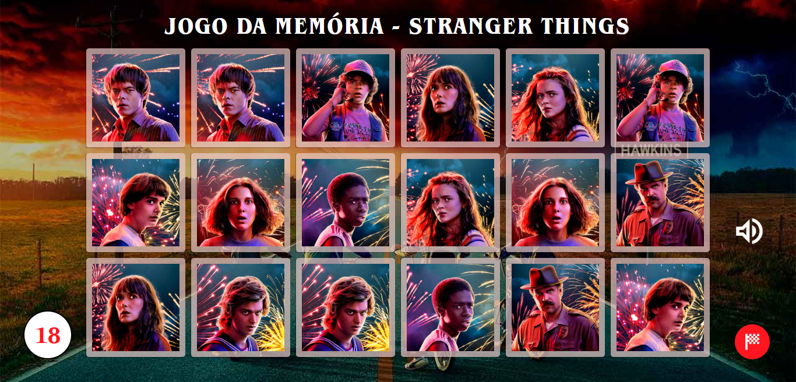
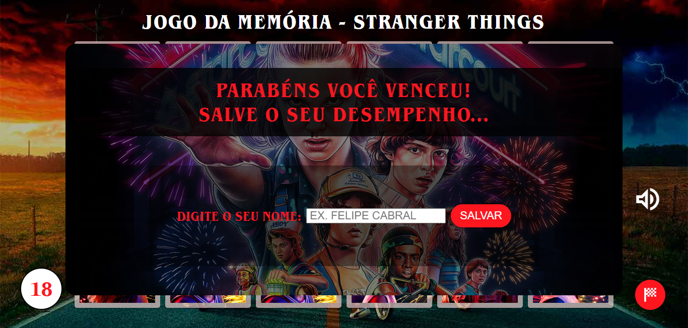
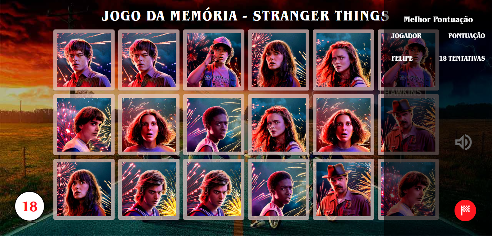
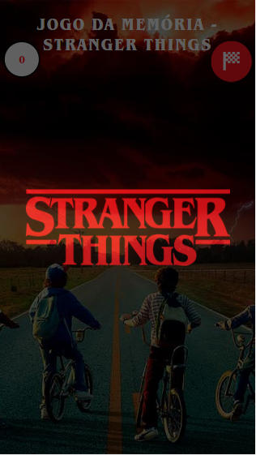
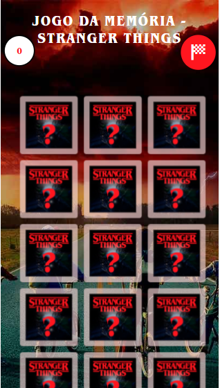
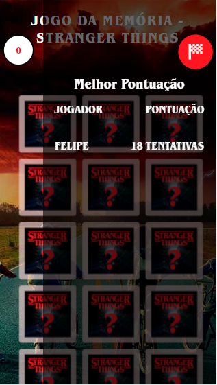

## Jogo da Memória - JS

Desafio de Projeto.

Criar um jogo da memória utilizando apenas HTML, CSS e Javascript. Com poucas linhas de código, efeitos 3D no CSS e lógica de programação utilizando condicionais.

**Tecnologias e ferramentas utilizadas:**

- HTML5
- CSS3
- JavaScript
- Plugin: JavaScript Cookie
- Photoshop

- VS Code

  

Confira como ficou o projeto:

Link: https://jogo-memoria-js.netlify.app/

O jogo foi feito inspirado na série Stranger Things.

**Recursos**

- Música tema de fundo.
- Efeito sonoro na virada de carta.
- Menu de Melhor pontuação obtida no dispositivo, dado armazenado nos cookies.
- Indicador do números de tentativas.
- Botão mute para parar a música tema. 

### Páginas

Página principal, carregamento com logo centralizado, utilizando keyframes  - CSS o logo desaparece lentamente e aparece os cards, ao interagir com a página começa a tocar a música tema da série.

Jogo carregado:

**Elementos da tela:**

1 - Cards.

2 - Indicador de tentativas.

3 - Pause / Play música tema.

4 - Menu de melhor pontuação obtida no dispositivo.

Jogo resolvido:

Ao completar o jogo, é exibido a tela de sucesso e solicita para digitar o nome do jogador para armazenar a sua melhor pontuação.

Ao clicar no botão vermelho, é exibido a melhor pontuação obtida no dispositivo, o dado de score está armazenado no cache.

### Responsividade 

> Instrutor: **Gabriela Pinheiro**

> Bootcamp TQI Fullstack Developer